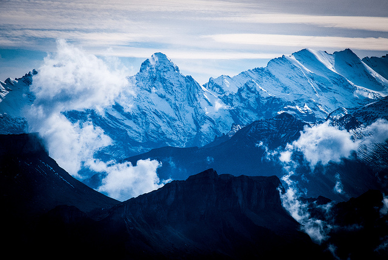

Switzerland photos
##################

:category: travel
:image: {filename}../images/10262232036_495e77c443_z.jpg

I'm pretty underwhelmed with many of the [pictures I took from Switzerland](https://www.flickr.com/photos/jtvanlew/sets/72157636528671866/), but they're up on flickr. This one *almost* faithfully recreates the majesty of the Alps. This was taken on top of Rothorn, near Brienz. 

I think the major issue I have with all my pictures is simply that its very, very hard for an image to represent how awesome the views are. How can a picture of a snow-capped peak give the feeling of the cool air, warm sun, and cold Swiss beer that you're absorbing at the same time? Well, I'm sure someone more talented than me can do it. As it is, I have these imposters that will just have to stand in for now.

I've uploaded them all to flickr but did none of the color processing that I normally need to do. So they'll all seem grey and flat, but they're up.