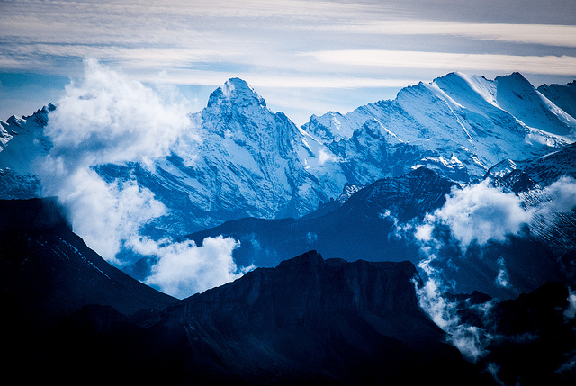

Switzerland photos
##################

:date: 2013-10-16
:modified: 2026-05-12
:tags: travel, photography, switzerland
:image: {filename}../images/10262232036_495e77c443_z.jpg
:gallery: {photo}2013/09-20-Switzerland
:gallery_sort: filename
:summary: A few days in Switzerland following the ISFNT in Barcelona

Rather than leaving this old guy with my flickr link, decided to process through this folder of photos again. Highlight of the trip was getting abandoned by our friends on the top of Rothorn. While they took the comfortable train back down to Brienz, Damien and I entered adventure mode with no choice but to dash down the mountain to catch the train. 

gallery::{photo}2013/09-20-Switzerland