Surly 29er to 650ber
####################

:description: The process of converting the Surly Ogre from a run-of-the-mill 29er to a beautiful 650b princess
:category: bikes
:image: {filename}../images/IMG_0941.jpg

Chapter 1: The Brompton Beginnings
==================================
This begins with me ~~stealing~~ saving Cindy's Brompton. She's drunk the Marie Kondo koolaid and has been purging everything that's fun from her garage. For a long time I was only using it as a dog runner at nights since the low top-tube made it really easy to get on and off for picking up their turds & the pint size is just convenient for going up and down in the apartment. The bike has always been fun to ride but my last shreds of dignity (and noticeable lack of tweed) meant every time I commuted to work or took it to liquor store I couldn't help but be self-concscious. 

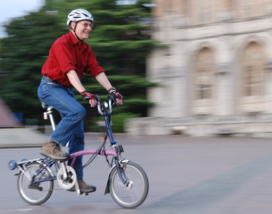

Enter: the huge rise in popularity of Byrds, Limes, Lyft-whateverthefucktheyares, and other e-scooters. For me, the greatest unintended consequence of these blights of sidewalks is their normalization of extremely nerdy modes of transportation. A giant nerd on a Brompton is now easily only the 4th most embarrassing way to get around the city. Because of that, I began riding a lot more regularly on the little folder. In time, I came to really appreciate the experience of an internally geared hub. Especially in contrast to riding on my SOMA where every major stand-up-crank would send me lurching from a skip in the chain (misaligned derailler? not-perfect friction shift? worn chainring? worn chain? worn rear cassette? some other exotic and undiagnosable piece of garbage?).

I began to daydream how nice a simple chain line would look on the Surly if I had an internal gear hub (SOMA's semi-vertical dropout would require a chain tensioner and kind of taint this image of beautiful chainline). For months I casually stalked ebay for a good deal on a Sturmey Archer until one morning there was a used RX-RF5 in great condition at a great price and I jumped on that grenade.

Chapter 2: The Decision
=======================
I wanted to lace this hub to a 650b wheel. 

That's about it. There was no consideration if I should or if I could (actually all Google searches implied I most definitely should not). I had a front 650b wheel I'd built for another conversion of a Japanese steel road bike into a more-comfortable 650b toy. And I just want to finally have a matching rear wheel that I could stick big ol' 2+" tires on and still have it fit in my SOMA if I so chose.

Anyway, nothing exciting here, I took a weekend to lace the wheel up (ok and I paid a buddy with a truing stand to do the final touches) and waited around for new tubes and tires. I went with these beautiful Schwalbe gum wall tires (Schwalbe G-One Speed V-Guard) to add a little classic touch and the conversion was beginning to take shape.

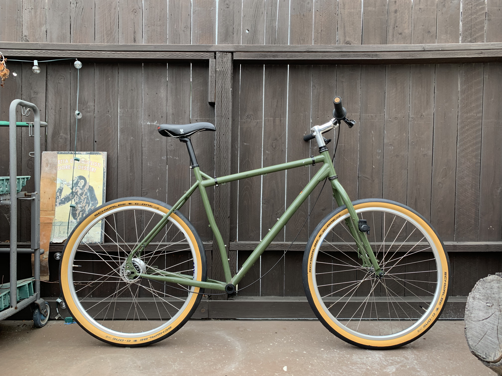

The only major issues, so far as I understand them, for conversion from a 3x9 29er to a 1x1 650b is
1. Getting a straight chainline
2. Rim brakes are neigh-on-impossible

Chapter 3: Crankrings & Chainlines
==================================
Inspiration

Execution

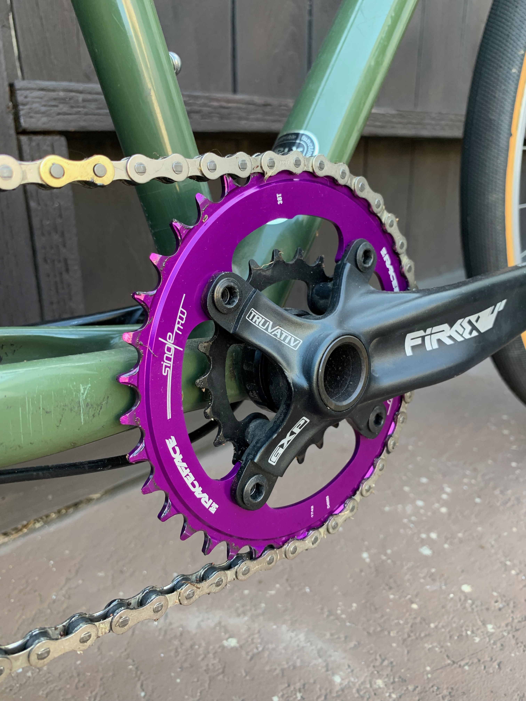

I got a race face narrow-wide 38t, 104 BCD crankring for the front. 38t with 110mm crank arms down to an 18t hub and 650b rim gave me mid-4 gain ratio in 3rd gear (the direct drive gear, with an eye on a future electric motor conversion??), and up to 6s gain ratio in the 4th and 5th gears. I have one major hill on the way to work with the rest pretty flat so those seemed sufficient.

It went pretty easily into the middle position of the old 3-ring setup that came stock on the Surly. One nice feature of the Surly crankarm bolts is the stubby nut that meant I could run with a single chain ring and didn't need to replace and/or machine the crankring bolts to work without the middle and outer crankrings. 

As far as chanline goes, according to all the dimensions I took for the bb width, crank spacing, and Sturmy-Archer hub, my line was supposed to be off by about 4mm. On paper this bothered me and I was getting a little depressed that there wasn't much I could do to fix it. But once the crankring showed up in the mail and I jammed it onto the crank arms, in fact it doesn't seem like such a big deal (I've since ridden this several dozen miles and haven't felt any kind of grinding or interference and definitely no chain jump-off so I might be in the clear)

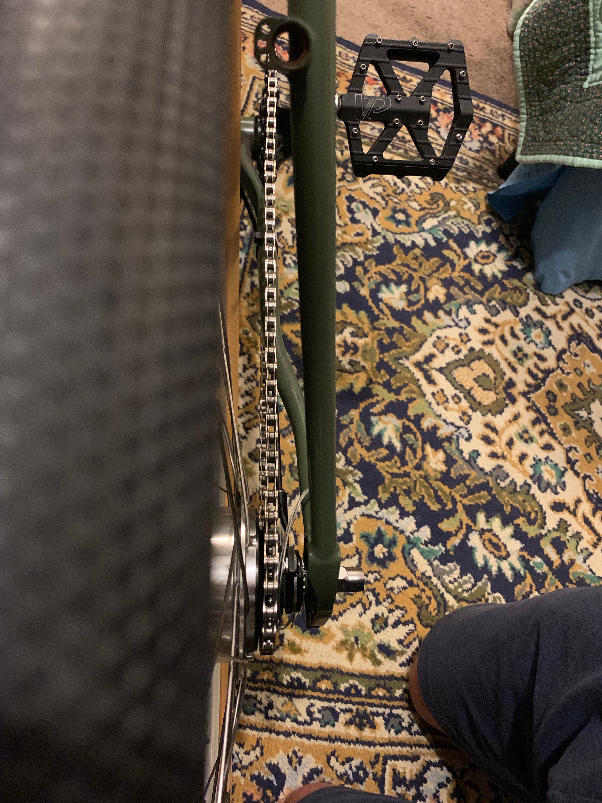

Chapter 4: Them's the Brakes
============================
If you do see mention of 700c/29er to 650b conversions you'll see everyone say it can be done so long as you have a disc brake. Not one to be bothered by facts, I was planning to stick to V-brakes and this meant the cantilever posts on the Surly were going to be of no use to me. My first plan was to machine an adapter that had a shape something roughly like this (and in this iteration I was actually thinking to use some side-pull brakes):

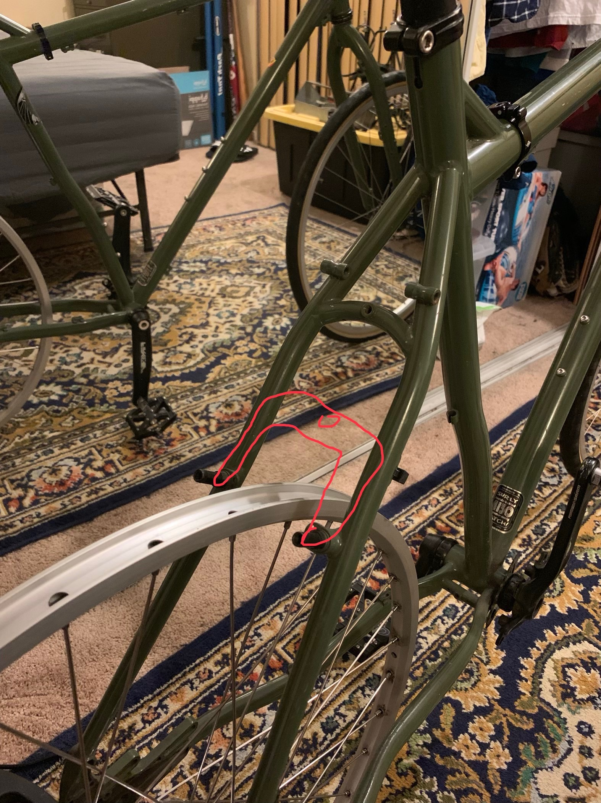

In fact, there were a few iteration of ideas between me and my boy Tom, the designer/machinist from my old UCLA lab. But theeeenn. I found these bad boys from a chinese machine shop on ebay:

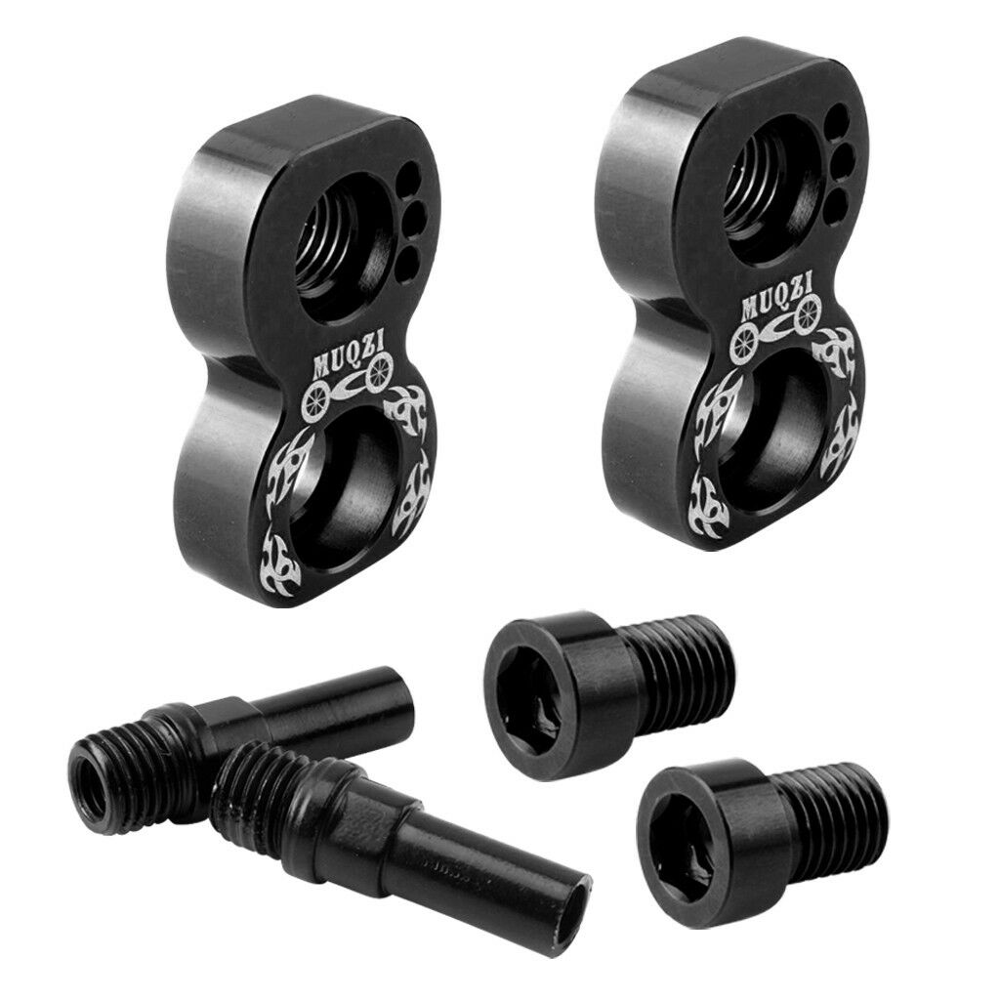

It was $15 for a full bike's worth of those adapters so I gave it a shot. Now, the adapters were intended to be used for converting an old 26" mountain bike into a 700c. So because I was using them upside-down from their original purpose, I wasn't sure they were going to work at all.

The Surly sat with those new wheels and no brakes for almost 2 weeks waiting for shipping from Shenzhen and I was getting more and more impatient to go out for a ride. They came in one evening I got home late from basketball and wanted to rush to install them. I was impatient enough that once the aluminum bolt was clearly not fitting into the braze-on for cantilever post, I just kept cranking down. Thank god it was aluminum bolt vs. steel frame because I sheared the shit out of that thing before I was luckily able to back it out without any permanent damage to my bike. I came to learn afterward that there are 2 standards for threading of cantilever posts. Some bikes use M10x1.25mm and some use M10x1mm. These adapters came with custom hex bolts with M10x1.25 and, without a doubt, the Surly is threaded for M10x1 -- a bolt that is much harder to come by. Ace Hardware, Home Depot, that unnamed Persian hardware store on Westwood, Amazon, ebay -- NONE OF THEM HAD ANY! Finally my only choice was through McMaster-Carr and when the new steel bolts finally showed up, there was another problem...

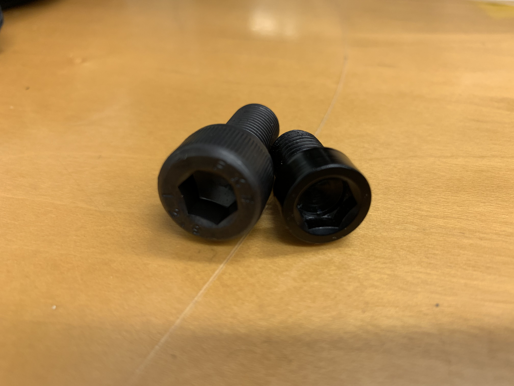

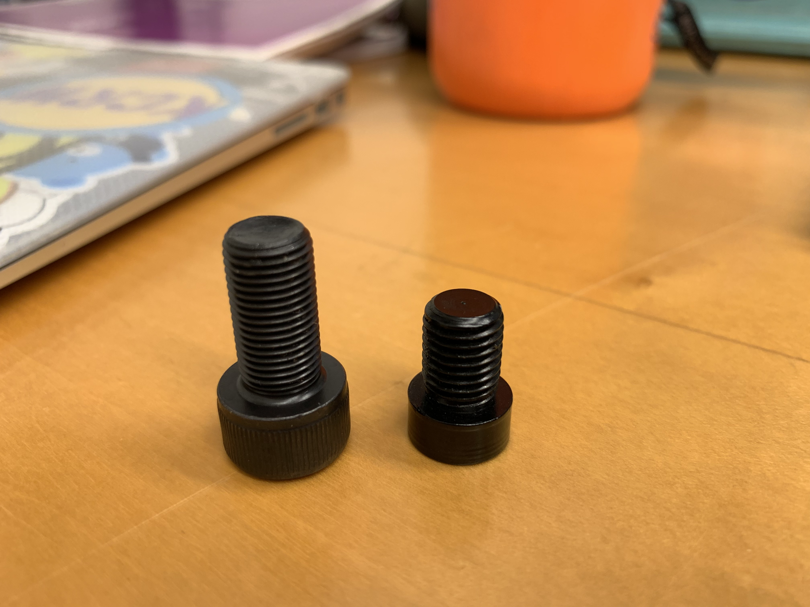

So now I had bolts that were too long, with caps too wide, oh and also the caps were too tall -- but at least they threaded into the braze-ons!

Chapter 5: Machine Shop
=======================
So I called up my boy Tom again and we mobilized. He met me after work at the UCLA Physics machine shop in the alley behind Helen's Cycles. Which, by the by, also houses the UCLA tokamak device. A tokamak, for the uninitiated, as a type of gigantic magnetic device that can contain plasma at temepartures and pressures high enough to achieve fusion. The tokamak-style of fusion containment is currently our best guess at having a commercial fusion reactor but we're still many many years from realizing such a dream. And if you're curious, the reason I no longer work at UCLA in the fusion lab is because our funding from the Department of Energy was cut for reasons both political and practical but it's part of a larger trend to not fund fusion research and, personally, a bad idea. The tokamak:

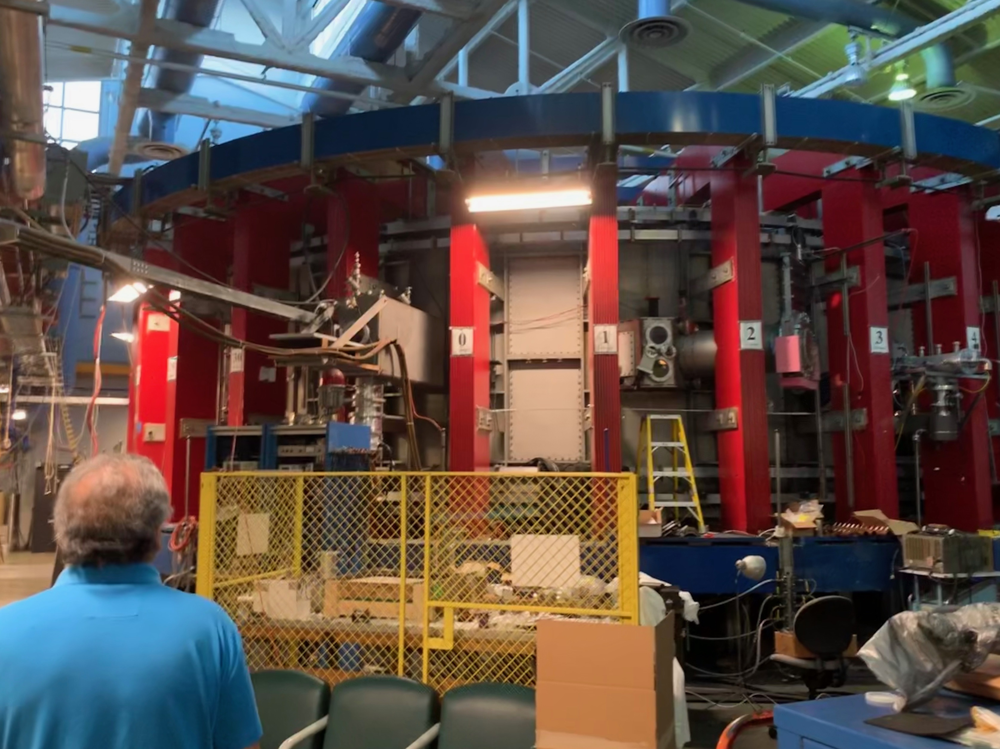

So I was kind of unnecesary in the shop as Tom did everything. It boiled down to mostly just needing to shave off nearly a quarter of an inch from the diameter and then trim off the face of the bolt cap.

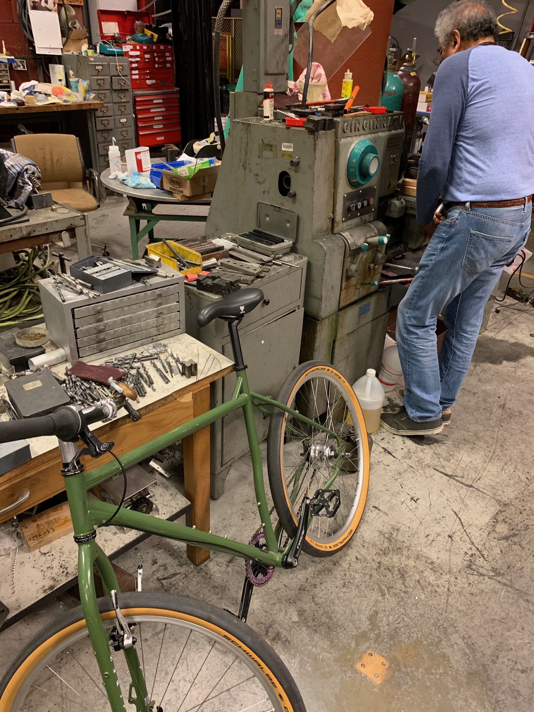

And some sick iphone slo-mo of the lathing in progress
{class="img-responsive"}

Now, I don't want to disparage these cheap aluminum Chinese V-brake adapters because they really were my best option and were very inexpensive and moreover I wasn't using the adapters for their intended purpose, but in some of them, the posts didn't sit perfectly normal and there was some interference between the brake itself and the face of the adapter. This picture shows a pronounced interference before we took down more of the face of the bolt. On several of the brake arms I had to stick them into a grinder to provide a little more clearance. Two of the pads had no interference issues at all.

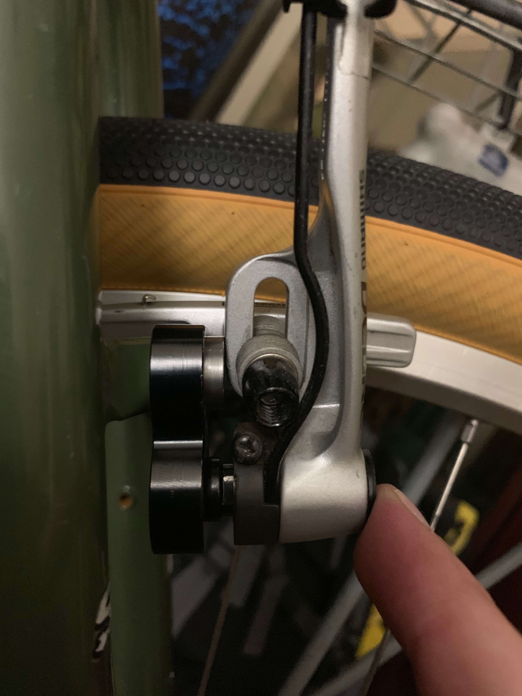

With that machining, I now had 4 sets of V-brake adapters that lowered the cantilever post enough to let me use standard sets of brakes and still reach the 650b rim. In this picture you can see how much lower the post sits compared to the original location in the fork's braze-on. Note: that bolt cap was machined to be totally flush with the adapter which meant there was very very little left of the cap for a hex screw so I had to be extraordinarily careful when tightening in order not to strip it.

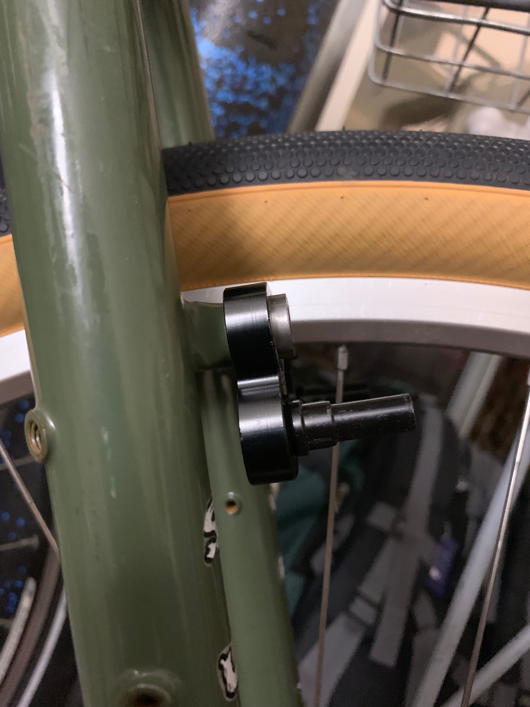

Things seemed peachy but I was still not quite in the clear. I'm not sure if there are multiple styles of V-brake posts but the brake arms I have are meant to sit on a post that is recessed a little in it's braze-on. These ebay adapters were totally flat which meant the canti post sat up just a few extra mm. The result being the alignment pin on the brakes barely-if-at-all went into the alignment holes on the brake adapters.

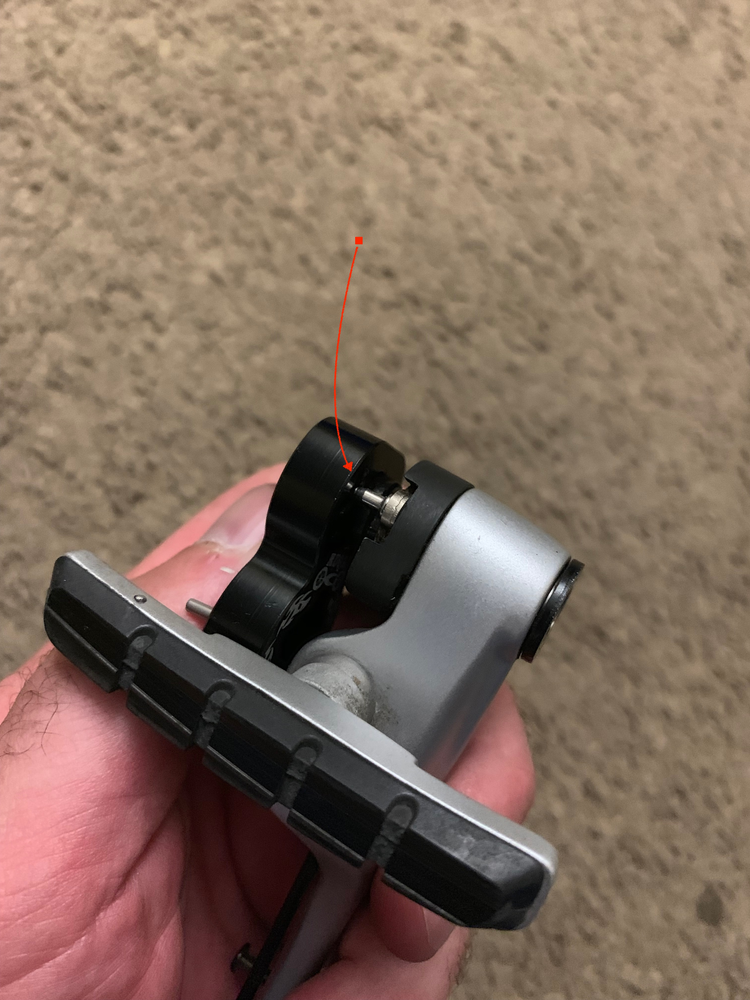

In fact, I had no solution for this. I did my best to place the brake arm in the right spot with the alignment pin and tightened it down. I can't tell on some of them if they're actually in the perfectly correct spot but nevertheless they have bene working and I haven't run into any issues yet. With this, the bike was, for better or worse, ready for the road.

Chapter 6: Glamour Shots
========================
I'm really, really happy with how this turned out. It wasn't quite a plug and play conversion but it was fun and rewarding to do something that I hadn't seen done already on the internet. So here she is:

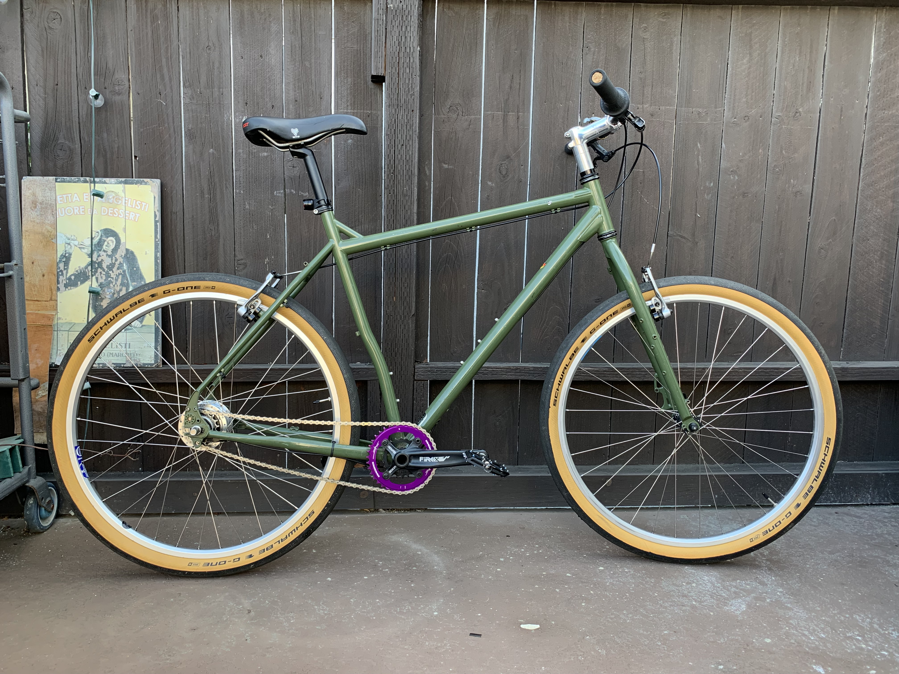

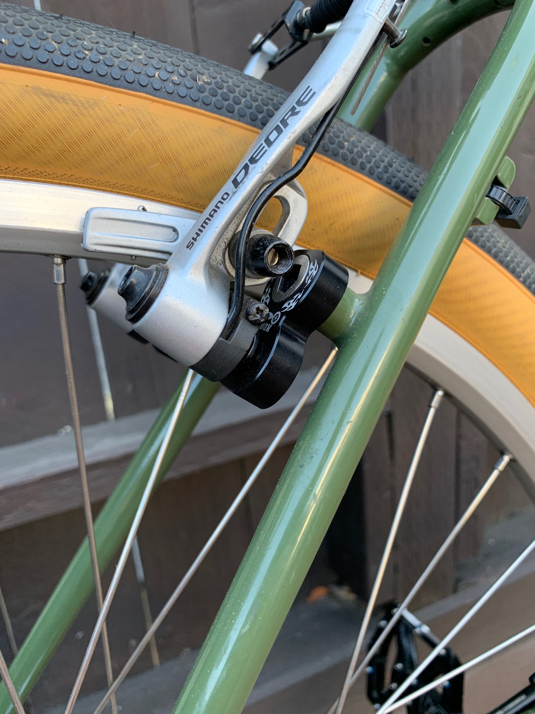

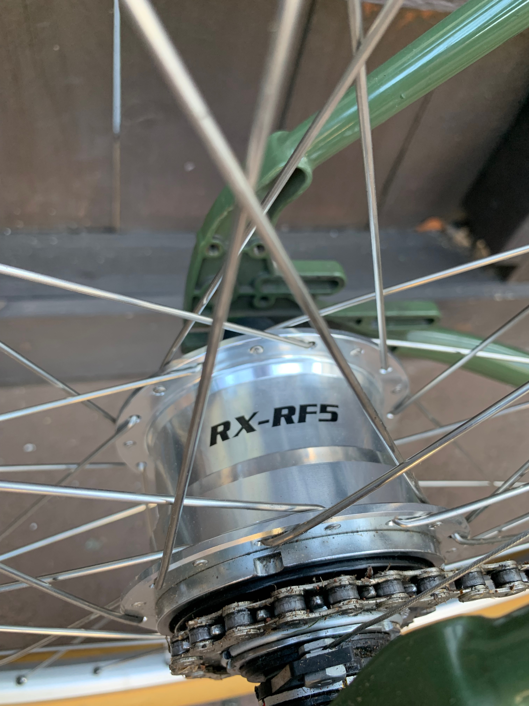

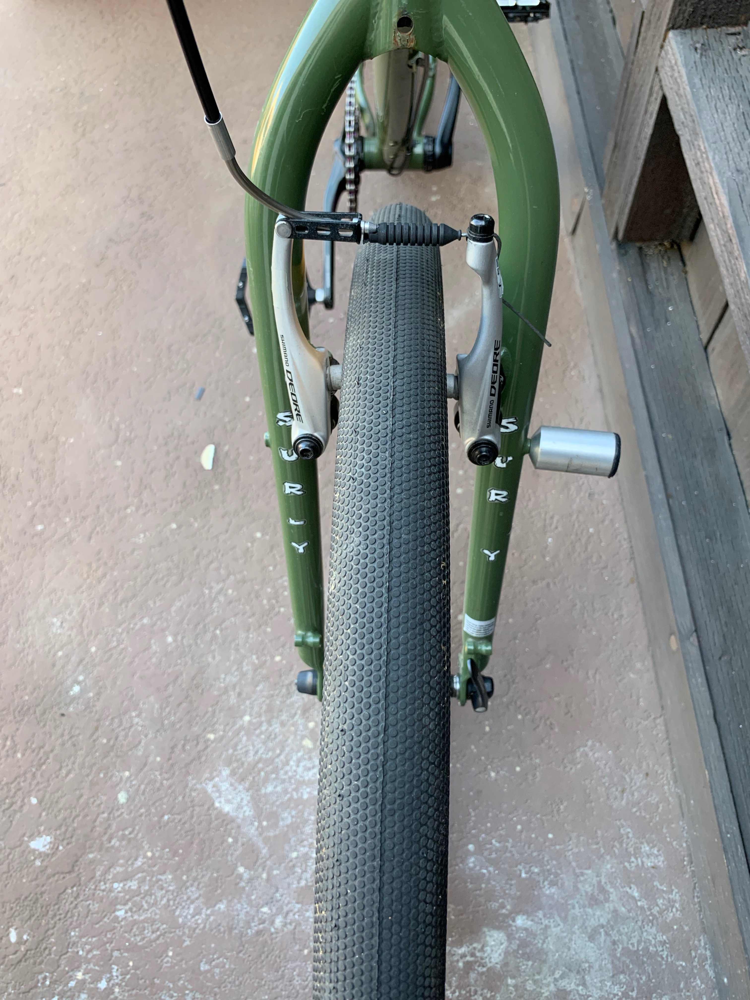

The 5 speed IGH gives me more than enough gear ranges and the direct chain line has been such a joy to trust when I stand up to crank from a stop and not worry about jumping a tooth. The Schwalbe G-One speed tires are also amazingly smooth and have not gotten any damage from the sections of my commute through homeless camps that are notorious for sharps in the tires. So far, I love it.
