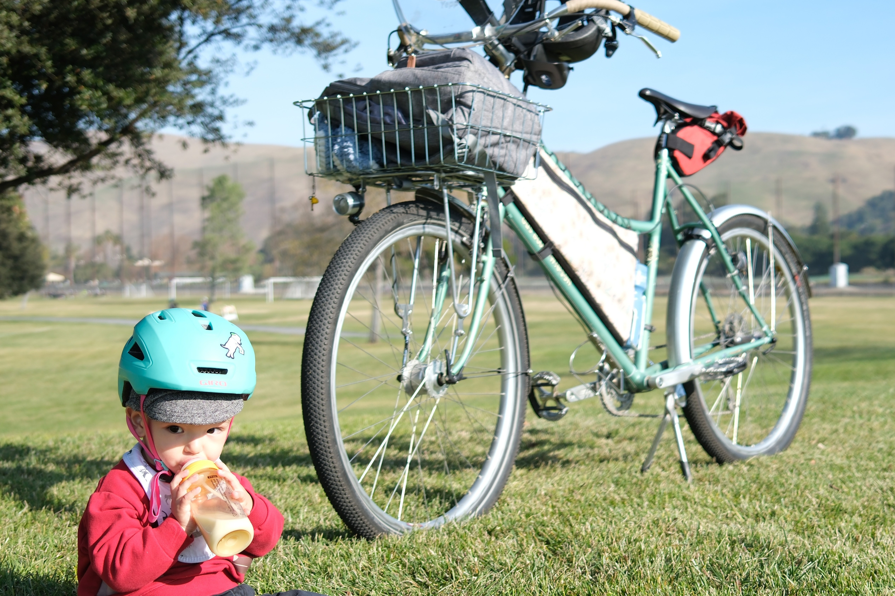

2022 Rivendell Gus Boots Wilsen
###############################

:bike: True
:date: 2025-03-16
:gallery: {photo}Bikes/Gus
:bgcolor: aquamarine
:image: ../images/DSCF9662.JPG
:make: Rivendell
:year: 2022 
:model: Gus Boots Wilsen

    
The premise
-----------

::

   Designer: *shows Grant Petersen updates on the Gus chainstay*
   Grant: Longer. 
   Designer: L-longer? *nervously stretches chainstay beyond all human obscenity*
   Grant: *nods with malice* Longer.
   Designer: *openly weeps*... *types '56 cm' into Autocad*... *hits enter*... *dies*
   Grant: Perfection.

The bike
--------

I got this big beautiful beast with the original intentions for it to be a dedicated bike camper and with full subscription to the RBW hillibike ethos. And I did of course take it on a couple bike campings and up and down the hills east of town. But it wasn't long before J.Meinte was born and I found the drooping top tube + insane stability of the geometry to be a perfect platform for child transporter. Gus now still goes out most weekends, but now for more chill hillirides with baby on board, down to the park, or as commuter to daycare and/or back.

gallery::{photo}Bikes/Gus

Build Details
-------------
(as of 2025-03-16)

Frame
=====

.. csv-table:: 
   :class: table
   :header: "Component", "Description"

   "Frame", "RBW S!lver CroMo 2022 Frameset, 60 XL / Mermaid"

Wheels & Braking
================

.. csv-table:: 
   :class: table
   :header: "Component", "Description"

   "Rims", "Velocity Cliffhanger 700C / 36h"
   "Front Hub", "Front Shimano 3N72 dyno"
   "Rear Hub", "Rear Shimano Deore T610"
   "Wheel assembly", "Hands On Wheels (Rich at RBW)"
   "Brakes", "Shimano (Alivio? who knows they're ancient) V-brake"
   "Brake Levers", "Ancient Tektro MTN levers"
   "Tires", "Teravail 'M'ehline 2.5 in"

Drivetrain
==========

.. csv-table:: 
   :class: table
   :header: "Component", "Description"

   "Rear Cassette", "S-ride 13-42t 7sp, CS E 500"
   "Crankset", "Silver - Wide/low double 38x24 (with guard) 74/110 bcd, 173 mm arms"
   "RD", "Shimano Deore LX (+ Wolftooth Roadlink extender)"
   "FD", "Shimano Deore XT"
   "Shifters", "Silver Shifters + RBW thumbies"

Cockpit & Touchpoints
=====================

.. csv-table:: 
   :class: table
   :header: "Component", "Description"

   "Handlebar", "Ron's Ortho Bar, 69 cm c-c, 26.0 mm clamp"
   "Grips", "Oury V2 tan + some Newbaums tape"
   "Stem", "Velo Orange 12cm, 26.0 mm"
   "Seatpost", "Nitto S65 Crystal Fellow - 26.8 x 300 mm"
   "Saddle", "Brooks C19-Carved"
   "Pedals", "MKS Monarch + little wing extenders"

Accessories
===========

.. csv-table:: 
   :class: table
   :header: "Component", "Description"

   "Lighting", "Front: Busch & Müller Lumotec IQ-XS; Rear: Busch & Müller SecuZED Plus"
   "Pump", "Zefal HPX(-4?)"
   "Rear Rack", "Nitto x Rivendell 52F basket rack + Wald 139"
   "Kickstand", "Soma Heavy Duty Double"

