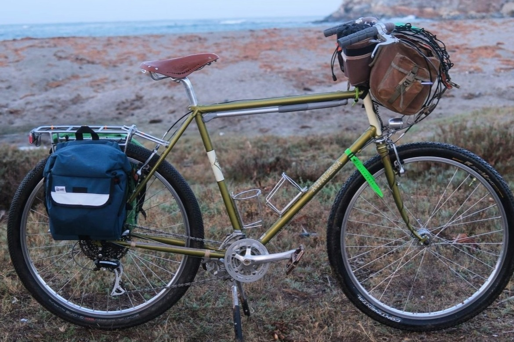
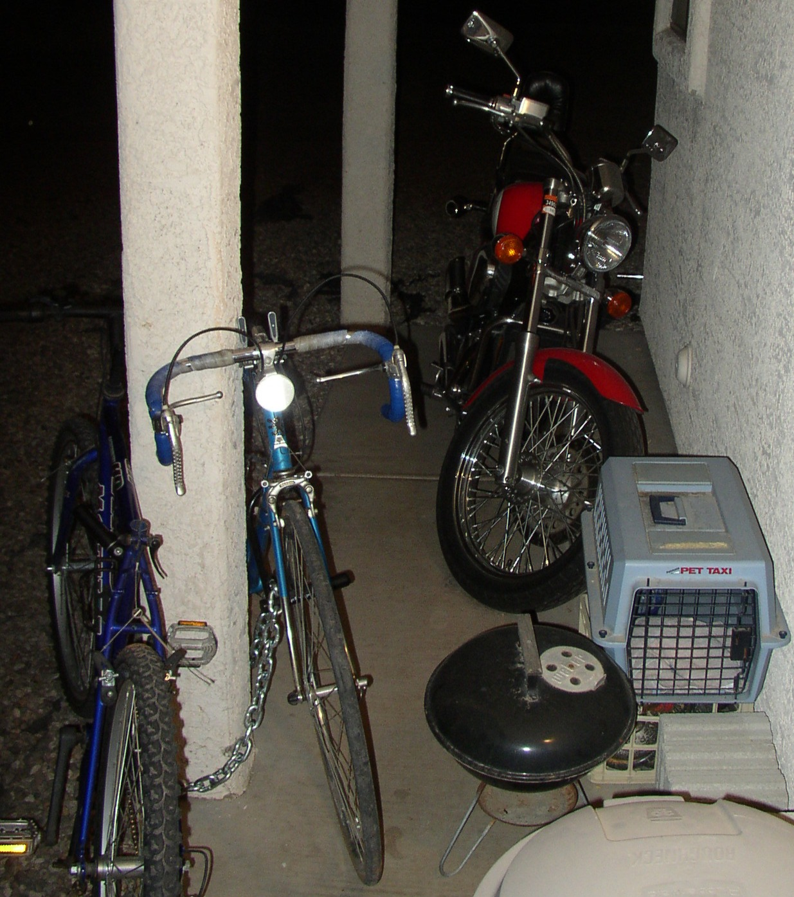

My bikes
########

:date: 2025-03-16

And I quote:

   "I love my bike. My bike is everything to me. My bike is my gym, my church, and my wheelchair. My bike is everything that I believe in going on in the Biosphere. It's science, it's technology, it's the future, engineering, metallurgy - you name it, it's right there in my bike. My bike is the most important and valuable thing that I have," 

   Bill Walton

.. raw:: html

    <embed>
        

    </embed>

.. csv-table:: 
   :class: table

   "`Rivendell / 2023 / A. Homer Hilsen <{filename}2023-a-homer-hilsen.rst>`_ |homer|", "`Rivendell / 2024 / Roaduno <{filename}2024-roaduno.rst>`_ |roaduno|"
   "`Rivendell / 2023 / Joe Appalloosa <{filename}2023-joe-appaloosa.rst>`_ |appalloosa|", "`Rivendell / 2022 / Gus Boots Wilsen <{filename}2022-gus-boots-wilsen.rst>`_ |gus| "
   "`Schwinn / 1983 / High Sierra <{filename}1983-schwinn-high-sierra.rst>`_ |schwinn|", "`Surly / 2012 / Ogre <{filename}2012-surly-ogre.rst>`_ |ogre|"
   "`SOMA / 2010 / DoubleCross <{filename}2010-soma-doublecross.rst>`_ |soma|", "Peugeot / 197X / ???"
   

.. raw:: html

    <embed>
        

    </embed>

.. |gus| image:: ../images/DSCF9662.JPG
   :alt: 2022 Gus Boots Wilsen
   :class: img-responsive
   :target: {filename}2022-gus-boots-wilsen.rst

.. |roaduno| image:: ../images/DSCQ0022.JPG
   :alt: 2024 Rivendell Roaduno
   :class: img-responsive
   :target: {filename}2024-roaduno.rst

I've had a handful of badass bikes in the last 20+ years. The first in my adult life was a Peugeot 10-speed I got from my neighbor in Chandler. I rode all around Tucson with almost no maintenance for almost 10 years. What else could you ever need besides tooling around on a beat up old steel bike with drop bars and skinny tires? 

   Peugeot in 2003, unceremoniously chained up out front of my house in Tucson alongside some random piece of crap bike on my super sweet Honda Shadow cruiser. Complete with rotting bar tape and suicide brake levers that I nevertheless rode every day and with great love.

Then sometime in the late 00s, I found myself looking at Rivendell Albatross handlebars. I probably visited the store page a dozen times over several months. I remember being in Taiwan for the first time ever and borrowing Cindy's laptop to look one more time and build up the nerve to buy them. For one thing, I think they were $80 at the time? Don't remember but to me it was an insane amount of money for a single part of a bike. Moreover, I would need to get new brake levers, shifters, probably a stem (I didn't even know what kind of stem I had on the Peugeot)? grips? what the heck?

But there in Taiwan I finally clicked the purchase button and I've been going nuts on bikes ever since. 

.. figure:: ../images/DSC_1156.jpg
   :alt: Peugeot 10-speed
   :class: img-responsive

   Peugeot in 2009, sitting in my office at the University of Arizona. Doing my best impression of the Rivendell treatment: Albatross bars, cork grips with several layers of shellac, and an insane Brooks saddle I got from my good buddy Ben.

It wasn't long before I felt I needed more than the Peugeot. I was ignorant af about bike stuff, and kept running into issues of trying to get some new gear and not realizing it didn't fit the French standard to which that bike was built. I also felt like that bike had done some excellent service, but since I was graduating with my Masters degree and preparing to move to LA for more school at UCLA, it seemed natural to get something newer and shinier. Thus I'll end this little intro on the SOMA DoubleCross I spec'ed out with a bike shop in Tucson and my mom bought as a graduation present.

.. figure:: ../images/P1090947.JPG
   :alt: SOMA DoubleCross
   :class: img-responsive

   The SOMA DoubleCross in 2010, soon after first getting it from the bike shop, representing the Platonic Ideal of what I thought a bike should be. On its first ride around Saguaro National Park on the east side of Tucson.

It has been a somewhat nonstop obsession since then. While at UCLA I used student loan money one quarter to also get a Surly Ogre. With those two bikes as platforms, there were countless iterations and tinkerings with which I learned a ton about bike mechanics and started developing my strong opinions about what a bike should be. I've built now maybe a dozen bikes from the frame up (or down to the frame, and then back up) but every one of them has some echo of those Peugeot and SOMA.

